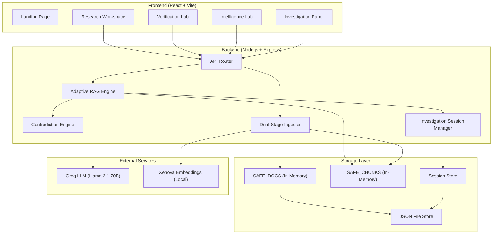
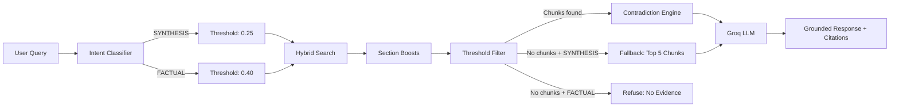
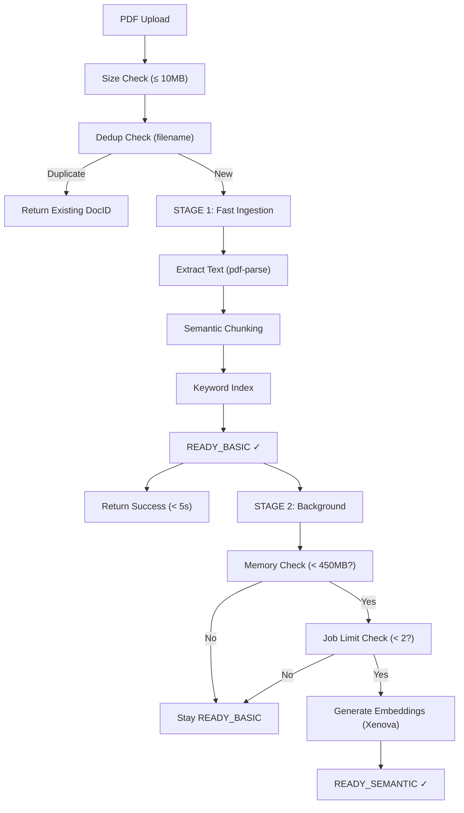

# VeriXa Intelligence OS — Architecture

> Version: 2.0 (Lockdown Phase)
> Philosophy: Evidence > Generation. Trust > Fluency. Stability > Complexity.

---

## 1. System Overview



---

## 2. Core Philosophy: Evidence Over Generation

VeriXa is NOT a chatbot. Every AI response is backstopped by a multi-stage retrieval and verification pipeline. The system will refuse to answer rather than generate ungrounded content.

**Design principles:**
- Citation-first prompts (`[Source X]` required for every claim)
- Explicit confidence labeling (HIGH / MEDIUM / LOW / LIMITED / NO EVIDENCE)
- Contradiction surfacing (conflicts are features, not bugs)
- Transparent retrieval telemetry (intent, threshold, scores visible in UI)

---

## 3. Adaptive Retrieval Pipeline



### Intent Classification

35+ synthesis patterns and 15+ factual patterns are matched against the query. Short queries (< 6 words) default to SYNTHESIS.

### Hybrid Scoring

```
score = (semantic × weight) + (keyword × weight) + sectionBoost

SYNTHESIS: semantic=0.6, keyword=0.4
FACTUAL:   semantic=0.7, keyword=0.3
```

### Section Boosts (SYNTHESIS mode only)

| Section | Boost | Rationale |
|---|---|---|
| Abstract | +0.25 | Core summary content |
| Conclusion | +0.20 | Final analytical takeaway |
| Summary | +0.20 | Direct answer to "what is this about" |
| Introduction | +0.15 | Context and background |
| Results | +0.15 | Key findings |
| Discussion | +0.12 | Interpretation and implications |
| Methods | +0.10 | Methodology details |

### Fallback Synthesis

When SYNTHESIS intent fails to find chunks above threshold but the vault has documents, the system takes the top 5 chunks regardless and labels the response as `LIMITED` confidence — preventing false refusals.

---

## 4. Dual-Stage Ingestion



### State Machine

```
UPLOADING → EXTRACTING → INDEXING → READY_BASIC → ENHANCING → READY_SEMANTIC
                                   └──→ (stays READY_BASIC if resources low)
```

---

## 5. Contradiction Intelligence

The Contradiction Engine (`contradictionService.js`) operates as a reasoning layer on top of retrieval:

1. Receives enriched source chunks from the RAG pipeline
2. Analyzes for conflicting claims, methodological disagreements, and statistical inconsistencies
3. Returns structured contradiction reports with explanations
4. Results are surfaced in the UI as red-badged alerts and logged to the Investigation Timeline

---

## 6. Investigation Session Manager

Provides global forensic context across all workspaces:

- **Evidence Ledger**: Central repository of all retrieved artifacts with credibility scores
- **Forensic Timeline**: Chronological event log (queries, contradictions, report generation)
- **Trust Score**: Aggregate confidence metric computed from evidence quality and contradiction density
- **Cross-Workspace Continuity**: Claims verified in Verification Lab can be researched in Research Workspace and monitored in Intelligence Lab

---

## 7. Memory Management (SAFE_MODE)

```
┌─────────────────────────────────────┐
│          MEMORY BUDGET (512MB)       │
├─────────────────────────────────────┤
│ Xenova Model:         ~120 MB       │
│ Node.js Baseline:     ~80 MB        │
│ Document Store:       ~50 MB        │
│ Session State:        ~20 MB        │
│ Safety Buffer:        ~242 MB       │
├─────────────────────────────────────┤
│ GUARD: 450MB → Emergency Purge      │
│ CLEANUP: 30-min session expiry      │
│ LIMIT: 2 concurrent embed jobs      │
│ LIMIT: 15 chunks/doc for embeddings │
│ STORE SYNC: Every 2 minutes         │
└─────────────────────────────────────┘
```

---

## 8. Prompt Architecture

All prompts are versioned and stored in `/backend/prompts/`:

| File | Purpose |
|---|---|
| `researchPrompts.js` | RAG grounded responses (v1: factual, v2: synthesis) |
| `contradictionPrompts.js` | Cross-document conflict analysis |
| `verificationPrompts.js` | Claim verification and trust scoring |
| `exportPrompts.js` | Forensic report generation (v2) |

---

## 9. API Surface

| Method | Endpoint | Purpose |
|---|---|---|
| POST | `/api/pdf/ingest` | Upload and process PDF |
| GET | `/api/pdf/status/:id` | Check ingestion status |
| POST | `/api/rag/query` | Execute grounded query |
| POST | `/api/rag/report` | Generate forensic report |
| GET | `/api/rag/documents` | List vault contents |
| GET | `/api/investigation/:sessionId` | Get investigation context |
| POST | `/api/investigation/:sessionId/event` | Log investigation event |
| GET | `/api/admin/telemetry` | System health metrics |
| GET | `/ping` | Liveness check |
| GET | `/health` | Health check with mode info |

---

*Architecture frozen. Stability > complexity.*
