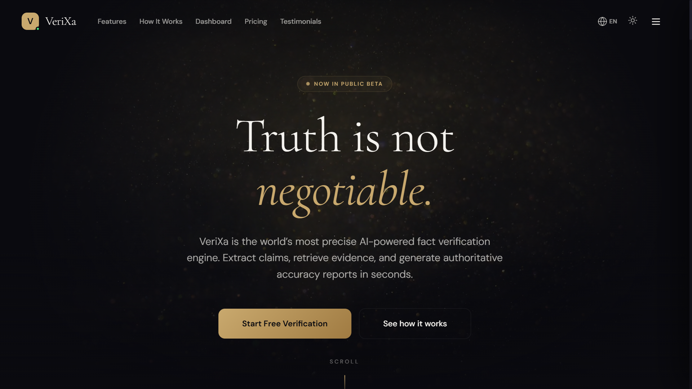
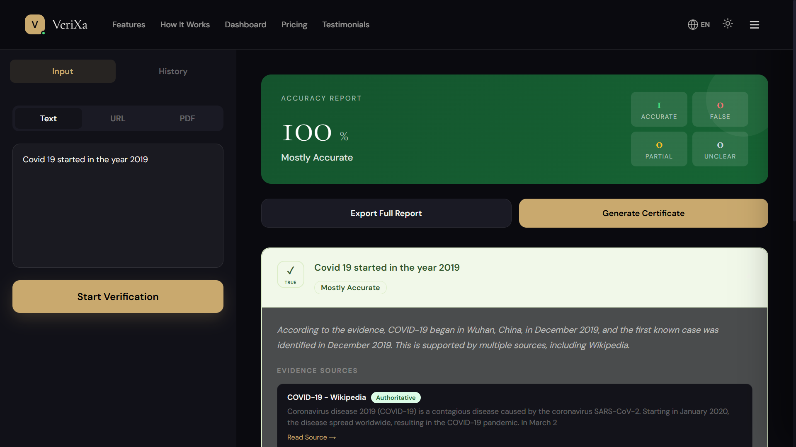
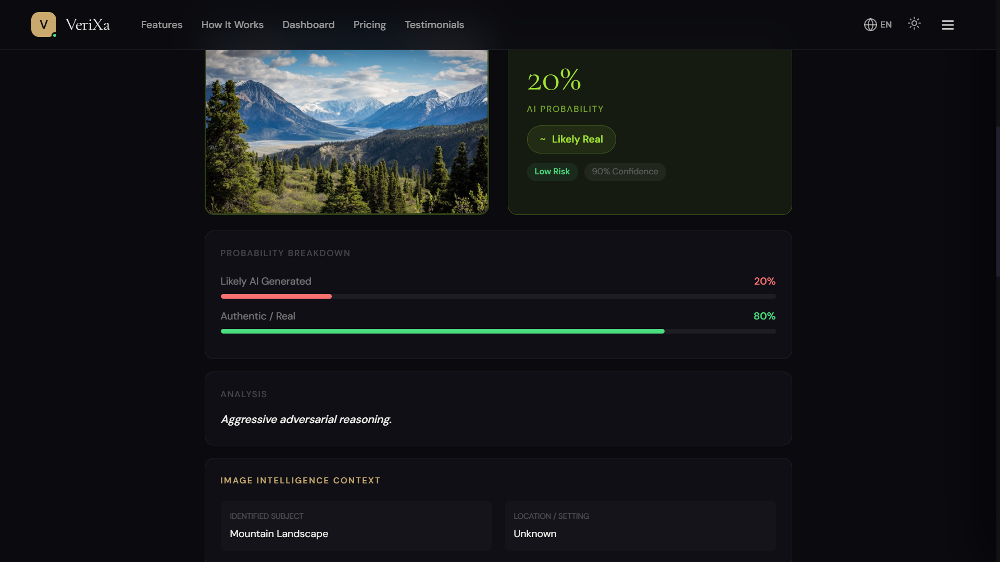
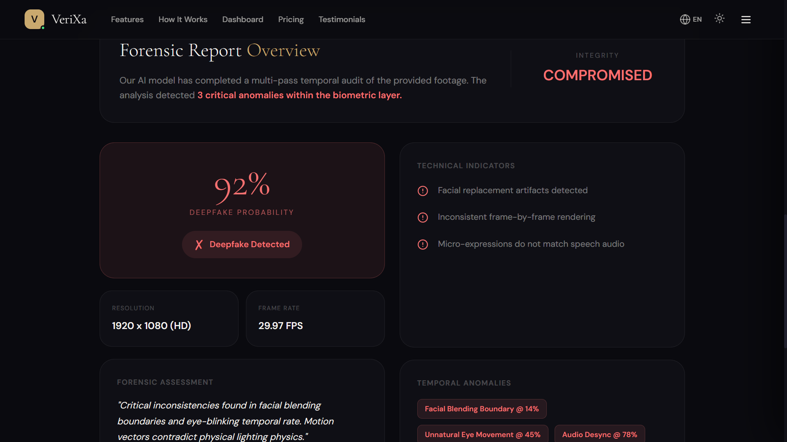
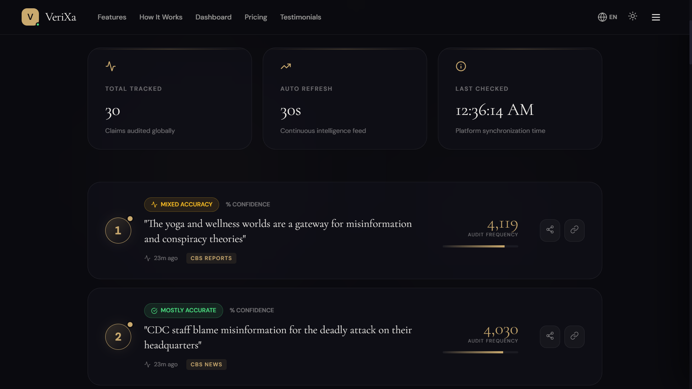

# VeriXa 🛡️

<div align="center">

### Truth is not negotiable.

AI-powered fact verification and misinformation intelligence platform designed to analyze claims, detect manipulated media, and generate contextual verification reports in real time.

[](https://verixa-gamma.vercel.app)
[](LICENSE)
[]()

</div>

---

# 🚀 Overview

VeriXa is an AI-powered verification ecosystem focused on combating misinformation, deepfakes, manipulated media, and false claims across digital platforms.

The platform combines intelligent verification workflows, contextual analysis, media forensics, and real-time AI reasoning to help users evaluate the authenticity of information in seconds.

Built with a cinematic modern UI and scalable AI-driven architecture, VeriXa aims to evolve into a next-generation trust and verification platform.

---

# ✨ Core Features

## 🧠 AI Fact Verification
- Analyze textual claims using contextual reasoning
- Generate intelligent verification reports
- Detect misinformation patterns
- Evidence-oriented verification workflows

## 🖼️ AI Image Intelligence
- Detect AI-generated imagery
- Analyze image metadata and inconsistencies
- Deepfake artifact inspection
- Visual authenticity scoring

## 🎥 Deepfake Video Detection
- Temporal consistency analysis
- Synthetic media detection
- Biometric and motion artifact inspection
- Video integrity workflows

## 🌍 Global News Intelligence
- Real-time misinformation monitoring
- Verification confidence indicators
- AI-powered credibility tracking
- Trend and narrative analysis

## 📄 Multi-Input Verification
Supports:
- Text
- URLs
- PDFs
- Images
- Videos

---

# 🛠️ Tech Stack

## Frontend
- React.js
- Tailwind CSS
- JavaScript
- Framer Motion

## AI / Verification Concepts
- LLM-based reasoning
- Contextual retrieval workflows
- Media authenticity analysis
- AI-generated content detection
- Verification confidence systems

## Deployment
- Vercel

---

# 🌐 Live Demo

🔗 https://verixa-gamma.vercel.app

---

# 📸 Screenshots

## Landing Page



---

## Verification Dashboard



---

## AI Image Intelligence



---

## Deepfake Video Detection



---

## Global News Intelligence



---

# 🧠 How VeriXa Works

```text
User Input
   ↓
Claim / Media Analysis
   ↓
Contextual AI Verification
   ↓
Evidence & Consistency Evaluation
   ↓
Authenticity Assessment
   ↓
Verification Report Generation
```

---

# 🏗️ Architecture Overview

```text
Frontend (React + Tailwind)
        ↓
Verification Layer
        ↓
AI Reasoning & Analysis Pipelines
        ↓
Contextual Verification Workflows
        ↓
Report & Confidence Generation
```

---

# ⚡ Installation

Clone the repository:

```bash
git clone https://github.com/Xeffen07G/Verixa.git
```

Navigate into the project:

```bash
cd Verixa
```

Install dependencies:

```bash
npm install
```

Run the development server:

```bash
npm run dev
```

---

# 📂 Project Structure

```bash
Verixa/
├── public/
├── src/
│   ├── assets/
│   ├── components/
│   ├── pages/
│   ├── sections/
│   ├── utils/
│   └── App.jsx
├── screenshots/
├── package.json
└── README.md
```

---

# 🎯 Future Improvements

- Real-time web evidence retrieval
- Multi-source verification engine
- Browser extension integration
- API access for developers
- Voice-based verification workflows
- Advanced AI confidence scoring
- Cross-platform synchronization
- Multi-language support

---

# 🧩 Challenges Faced

- Designing scalable AI verification workflows
- Creating cinematic responsive UI interactions
- Structuring multi-modal verification systems
- Handling contextual ambiguity in misinformation
- Building intuitive verification experiences

---

# 📌 Vision

VeriXa is designed to evolve into a complete AI trust infrastructure capable of helping users identify misinformation, manipulated media, and synthetic content across the internet in real time.

---

# 🤝 Contributing

Contributions, ideas, and improvements are welcome.

Fork the repository and submit a pull request.

---

# 👨‍💻 Developer

### Sayak Das

- GitHub: https://github.com/Xeffen07G
- LinkedIn: https://www.linkedin.com/in/sayak-das-460157287

---

# 📄 License

Licensed under the Apache 2.0 License.
