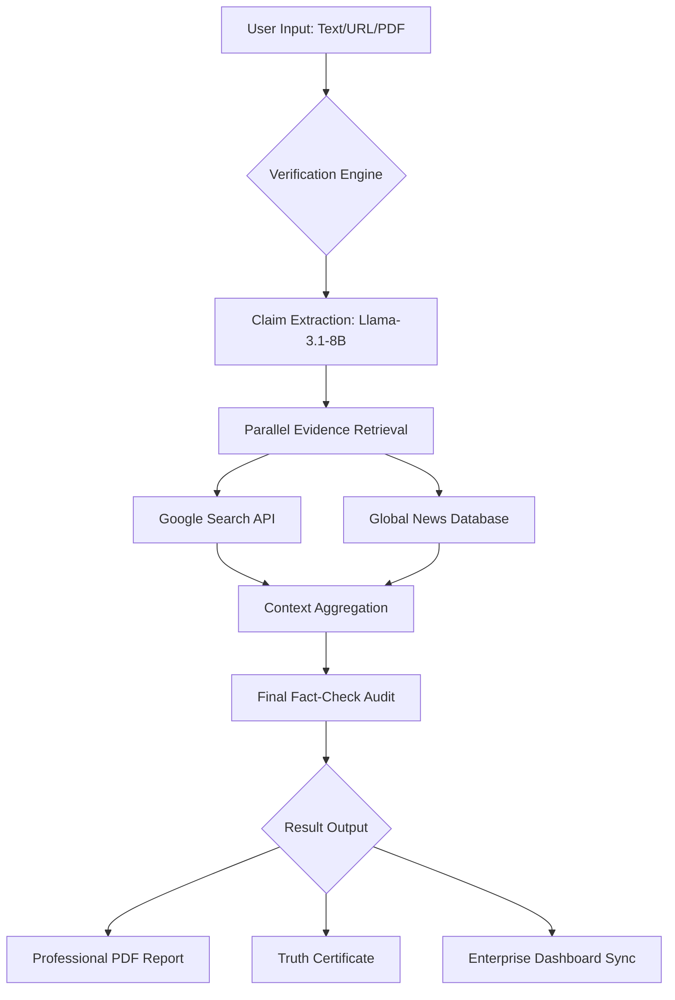

# 🌐 VeriXa: The Global Enterprise Identity & Truth Engine


> **"Trust is not negotiable. VeriXa is the infrastructure of digital integrity."**

VeriXa is a high-fidelity, enterprise-grade verification platform designed to combat misinformation and establish organizational integrity through AI-powered deep-trace intelligence.

---

## 📐 System Architecture & Logic Flow

The following diagram illustrates the high-velocity verification pipeline:



---

## 📂 Project Structure

A comprehensive map of the VeriXa ecosystem:

```text
verixa/
├── backend/                # Server-side Logic & AI Integration
│   ├── config/             # Database & Service Configurations
│   ├── middleware/         # Security, Rate Limiting & Auth Validation
│   ├── models/             # Mongoose Schemas (User, History, Org)
│   ├── routes/             # API Endpoints (Auth, Verify, User, Org)
│   ├── services/           # AI Logic (Groq, LLM Prompting)
│   ├── utils/              # Helper functions (PDF Parsing, Web Scraping)
│   └── server.js           # Main Entry Point
├── frontend/               # Client-side Application (React)
│   ├── public/             # Static Assets & Global Styles
│   └── src/
│       ├── components/     # Reusable UI (Navbar, Cards, Loaders)
│       ├── context/        # Global State (Auth, Identity)
│       ├── hooks/          # Custom Logic (useVerify)
│       ├── pages/          # Application Views (Dashboard, Account, Verify)
│       └── utils/          # Frontend Helpers (Formatting, i18n)
└── README.md               # Elite Technical Documentation
```

---

## 💎 The Enterprise Edge

VeriXa is engineered as a **Role-Based Intelligence Ecosystem** for modern corporate environments.

### 🛡️ Role-Based Access Control (RBAC)
| Feature | Admin (Head of Org) | Employee |
| :--- | :--- | :--- |
| **Data Visibility** | Global (All members) | Private (Self only) |
| **Team Analytics** | Active tracking & Leaderboards | N/A |
| **Audit Logs** | Global Master Feed | Personal History |
| **System Exports** | Global Company Reports | Personal Certificates |

### 🚀 High-Velocity Verification
Powered by **Groq's Llama-3.1-8B-Instant** model and parallelized search algorithms, VeriXa delivers comprehensive fact-check reports in **under 5 seconds**—a 500% increase in throughput compared to traditional sequential analysis.

---

## 🛠️ Technical Stack

| Layer | Technology |
| :--- | :--- |
| **Frontend** | React.js, Tailwind CSS, Lucide, Framer Motion |
| **Backend** | Node.js, Express.js |
| **Database** | MongoDB Atlas (Cloud Synchronized) |
| **AI Engine** | Groq Cloud (Llama-3.1-8B-Instant) |
| **Search Intelligence** | Google Custom Search JSON API |
| **Security** | Helmet.js, JWT, Bcrypt, CORS Hardening |

---

## 📡 API Reference

### Profile Management
`PUT /api/user/profile`
- Updates user metadata (Bio, Title, Location, Profile Pic).
- Payload: `{ userId, name, organization, bio, title, location, profilePic }`

### Organization Intelligence
`GET /api/organization/:orgName/history`
- **Admin Only**: Retrieves all verification logs for the entire organization.

`POST /api/organization/sync`
- Synchronizes local verification results with the corporate cloud database.

---

## 🚀 Quick Start Guide

### 1. Configure Environment
Create a `.env` file in the `backend/` directory:
```env
PORT=5000
MONGO_URI=your_mongodb_atlas_uri
GROQ_API_KEY=your_groq_api_key
GOOGLE_SEARCH_API_KEY=your_google_search_api_key
GOOGLE_SEARCH_CX=your_search_engine_id
JWT_SECRET=your_secret_key
```

### 2. Deployment & Installation
```bash
# Clone & Install
git clone https://github.com/Xeffen07G/verixa.git
cd verixa && npm install-all # Custom script

# Launch Development Environment
npm run dev
```

---

## 📈 Roadmap
- [x] **Phase 1:** Core AI Verification Engine
- [x] **Phase 2:** Enterprise RBAC & Organizational Dashboard
- [x] **Phase 3:** Professional Identity Hub (Account Management)
- [ ] **Phase 4:** Real-time Browser Extension (Social Verification)
- [ ] **Phase 5:** White-label Enterprise API (CMS Integration)

---

**Built with ⚖️ by the VeriXa Core Team.**
*"Establishing the gold standard for digital truth."*
