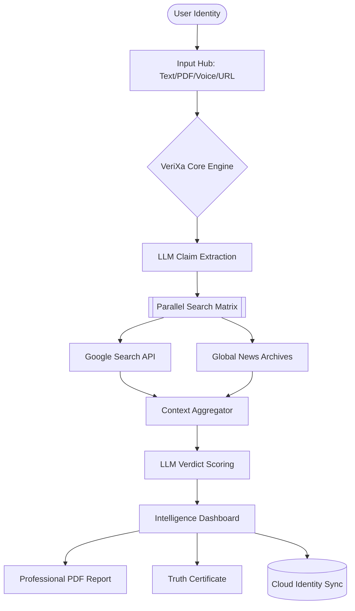

# 🌐 VeriXa: The Global Enterprise Identity & Truth Infrastructure


> **"In the age of deepfakes and AI hallucinations, truth is the most valuable commodity. VeriXa is the engine that generates it."**

VeriXa is a cinematic, enterprise-grade verification platform engineered to combat misinformation through parallelized AI-powered deep-trace intelligence. It transforms raw data into high-fidelity, verified reports with surgical precision.

---

## 📐 I. Technical Methodology

VeriXa operates on a proprietary three-stage "Intelligence Pipeline":

### 1. Atomic Claim Extraction
Using **Llama-3.1-8B-Instant**, the system performs semantic analysis on raw input (Text, PDF, or URL) to isolate "Atomic Claims"—the smallest individual units of verifiable information.

### 2. Parallel Evidence Retrieval
Instead of sequential searching, VeriXa triggers **asynchronous parallel search threads**. Each claim is assigned a dedicated thread that queries global news databases and authoritative sources simultaneously using the **Google Custom Search API**.

### 3. Verification & Verdict Scoring
The system cross-references retrieved evidence against the original claim using a specialized AI "Juror" prompt. It assigns a confidence score (0-100%) and a verdict based on the **VeriXa Truth Matrix**:
- **Verified True:** Substantial corroborating evidence.
- **Partially True:** Mixed evidence or missing context.
- **Verified False:** Explicitly contradicted by reputable sources.
- **Unverifiable:** Insufficient data or conflicting reports.

---

## 📊 II. System Architecture Flow



---

## 📂 III. Comprehensive Project Structure

```text
verixa/
├── backend/                        # High-Performance Node.js Environment
│   ├── config/                     # Database & External Service Config
│   │   └── db.js                   # MongoDB Atlas connection logic
│   ├── middleware/                 # System Security & Validation
│   │   └── validate.js             # API Key & JWT Authorization
│   ├── models/                     # Mongoose Data Schemas
│   │   ├── User.js                 # Professional Identity & Roles
│   │   └── History.js              # Verification Audit Records
│   ├── routes/                     # API Logic Layer
│   │   ├── auth.js                 # Identity Access Management
│   │   ├── verify.js               # Core Verification Engine
│   │   ├── user.js                 # Profile & Personalization
│   │   └── organization.js         # Enterprise Team Intelligence
│   ├── services/                   # Intelligent Logic
│   │   └── groq.js                 # Llama-3 + Groq API Integration
│   └── server.js                   # Application Bootloader
├── frontend/                       # Cinematic React Interface
│   ├── src/
│   │   ├── components/             # High-Fidelity UI Components
│   │   │   ├── Navbar.jsx          # Dynamic Navigation
│   │   │   ├── ScoreBanner.jsx     # Visual Accuracy Reporting
│   │   │   └── ClaimCard.jsx       # Detailed Verdict Interaction
│   │   ├── context/                # Global State Management
│   │   │   └── AuthContext.jsx     # Enterprise Session Security
│   │   ├── pages/                  # Full-Page Views
│   │   │   ├── DashboardPage.jsx   # Master Audit Feed
│   │   │   ├── AccountPage.jsx     # Professional Identity Hub
│   │   │   └── VerifyPage.jsx      # High-Speed Analysis Terminal
│   │   └── App.js                  # Client Route Manifest
└── README.md                       # VeriXa Master Specification
```

---

## 📡 IV. Detailed API Specification

### 1. Identity & Profile
- **`PUT /api/user/profile`**
  - **Description:** Updates the professional identity of the authenticated user.
  - **Payload:** `{ userId, name, organization, bio, title, location, profilePic }`
  - **Response:** `200 OK` with updated User Object.

### 2. Verification Core
- **`POST /api/verify`**
  - **Description:** Triggers the atomic claim extraction and parallel search engine.
  - **Payload:** `{ text, detectAI: boolean }`
  - **Response:** `200 OK` with `claims[]` and `overallScore`.

### 3. Enterprise Intelligence
- **`GET /api/organization/:orgName/history`**
  - **Description:** (Admin Only) Retrieves all audit logs for the specified organization.
  - **Security:** Requires validated JWT with `admin` role.

---

## 🛠️ V. Advanced Technical Stack

| Category | Technology | Implementation Detail |
| :--- | :--- | :--- |
| **Logic** | Node.js / Express | Asynchronous parallel processing |
| **Interface** | React 18+ | Glassmorphic design system |
| **Intelligence** | Llama-3.1-8B | Hosted on Groq for sub-second inference |
| **Database** | MongoDB Atlas | Real-time organization synchronization |
| **Styles** | Vanilla CSS | Custom "Aura Noir" theme |
| **Icons** | Lucide-React | Vector-based professional iconography |

---

## 🚀 VI. Professional Setup Guide

### 1. Prerequisite Environment
Ensure you have Node.js 16+ and a MongoDB Atlas cluster ready.

### 2. Environment Variables (.env)
```env
PORT=5000
MONGO_URI=mongodb+srv://...
GROQ_API_KEY=gsk_...
GOOGLE_SEARCH_API_KEY=...
GOOGLE_SEARCH_CX=...
JWT_SECRET=...
```

### 3. Installation Flow
```bash
# Clone the repository
git clone https://github.com/Xeffen07G/verixa.git

# Install and launch in a single command
npm install-all && npm run dev
```

---

## 📈 VII. Enterprise Roadmap
- [x] **Core AI Fact-Checking Engine**
- [x] **Enterprise Role-Based Access (Admin/Employee)**
- [x] **Professional Identity Hub & Stats Tracking**
- [ ] **Phase 4:** Browser Extension for Instant Social Verification
- [ ] **Phase 5:** White-label API for Enterprise CMS Integration

---

**Built with ⚖️ by the VeriXa Core Team.**
*"Truth as Infrastructure."*
