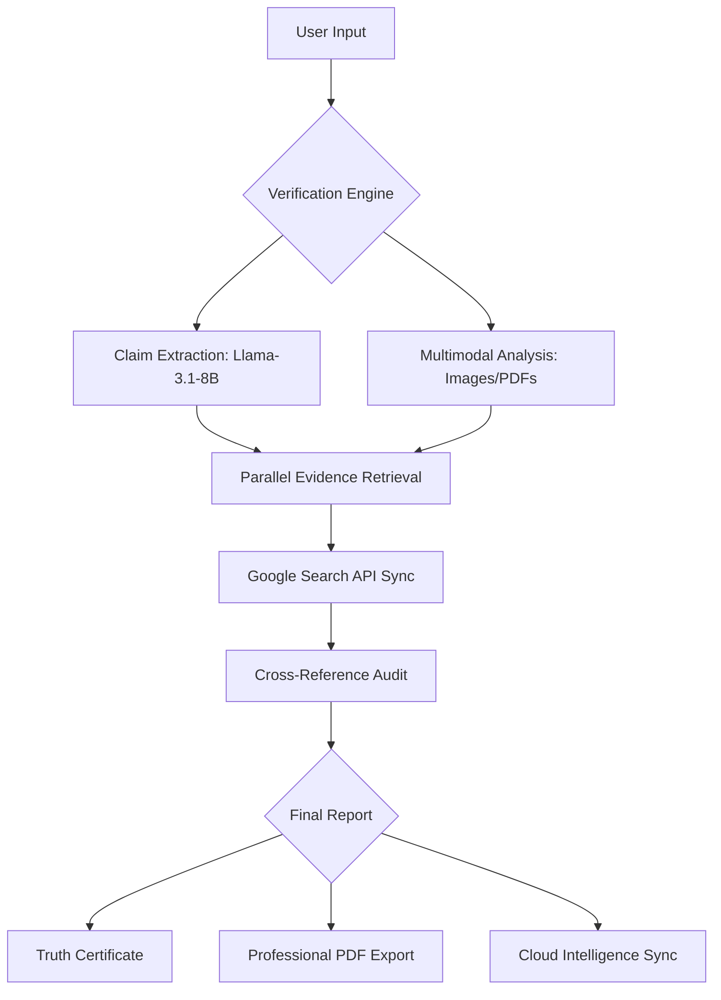

# 🌐 VeriXa: The Global Enterprise Identity & Truth Engine


> **"Truth is not negotiable. VeriXa is the infrastructure of digital integrity."**

VeriXa is a high-fidelity, enterprise-grade verification platform designed to combat misinformation and establish organizational integrity through AI-powered deep-trace intelligence.

---

## 📐 System Logic Flow



---

## 🚀 Core Feature Suite

### 1. AI Truth Analysis Engine 🧠
The heart of VeriXa. It uses **Llama-3.1-8B-Instant** to surgically extract individual claims from any text or URL and cross-references them against a global news database in parallel. 
- **Benefit:** Instant, unbiased fact-checking at the speed of thought.

### 2. Document & URL Forensics 📄
Don't just verify snippets—verify entire ecosystems. VeriXa can ingest complex **PDF documents** or **live web URLs**, extracting the core narrative and auditing it for factual consistency.
- **Benefit:** Perfect for legal compliance and corporate research.

### 3. Image Integrity Lab 📸
Analyze images to detect manipulation or verify the context of a visual claim. 
- **Benefit:** Combats visual misinformation and deepfake narratives.

### 4. Professional Identity Hub 👤
Every user gets a personalized **Professional Profile**. Manage your bio, professional title, and organization details while tracking your personal "Accuracy Score" and total audit count.
- **Benefit:** Establishes your authority as a verified analyst.

### 5. Truth Certificates & PDF Reports 🏆
Transform your analysis into a professional asset. Generate high-fidelity **Truth Certificates** with a custom gold seal or export exhaustive **PDF Reports** for your team or clients.
- **Benefit:** Provides a permanent, shareable record of integrity.

### 6. Real-Time Voice Intelligence 🎙️
VeriXa listens. Use the built-in voice-to-text engine to verify claims from live speeches, interviews, or meetings as they happen.
- **Benefit:** High-speed truth-tracking for the live media age.

### 7. AI Hallucination Detection 🤖
Detect if a piece of text was written by a human or generated by an AI. VeriXa provides a probability score to help you identify LLM-generated misinformation.
- **Benefit:** Ensures human-level authenticity in all communications.

---

## 📂 Project Structure

```text
verixa/
├── backend/                # Server-side Logic & AI Integration
│   ├── models/             # Mongoose Schemas (User, History)
│   ├── routes/             # API Endpoints (Auth, Verify, User)
│   ├── services/           # AI Logic (Groq, LLM Prompting)
│   └── server.js           # Main Entry Point
├── frontend/               # Client-side Application (React)
│   ├── components/         # Reusable UI (Navbar, Cards, Loaders)
│   ├── context/            # Global State (Auth, Identity)
│   └── pages/              # Application Views (Dashboard, Account, Verify)
└── README.md               # Elite Technical Documentation
```

---

## 🛠️ Technical Stack

| Layer | Technology |
| :--- | :--- |
| **Frontend** | React.js, Tailwind CSS, Lucide, Framer Motion |
| **Backend** | Node.js, Express.js |
| **AI Engine** | Groq Cloud (Llama-3.1-8B-Instant) |
| **Database** | MongoDB Atlas (Cloud Synchronized) |
| **Search** | Google Custom Search API |

---

## 🚀 Quick Start Guide

```bash
# Clone & Install
git clone https://github.com/Xeffen07G/verixa.git
cd verixa && npm install-all

# Launch Development Environment
npm run dev
```

---

**Built with ⚖️ by the VeriXa Core Team.**
*"Establishing the gold standard for digital truth."*
